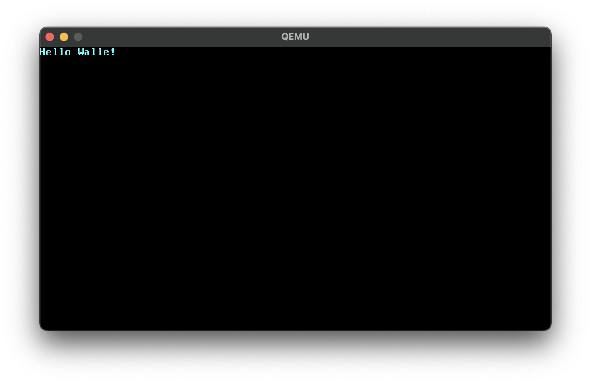

# Walle OS in Rust

## Fork

- https://github.com/phil-opp/blog_os

## Docs

- https://os.phil-opp.com/zh-CN/


## License

- Apache License, Version 2.0 ([LICENSE-APACHE](../../LICENSE-APACHE) or
  https://www.apache.org/licenses/LICENSE-2.0)
- MIT license ([LICENSE-MIT](../../LICENSE-MIT) or https://opensource.org/licenses/MIT)

## 编译为裸机目标

```bash
$ rustup target add aarch64-unknown-none
$ cargo build --target aarch64-unknown-none
```

## 在qemu-system-x86_64上测试

```bash
$ rustup target add x86_64-unknown-none
$ cargo bootimage
```

运行以上指令，会生产`target/x86_64-walle_os/debug/bootimage-walle_os.bin`

### 启动qemu

```bash
qemu-system-x86_64 -drive format=raw,file=target/x86_64-walle_os/debug/bootimage-walle_os.bin
```

运行结果


